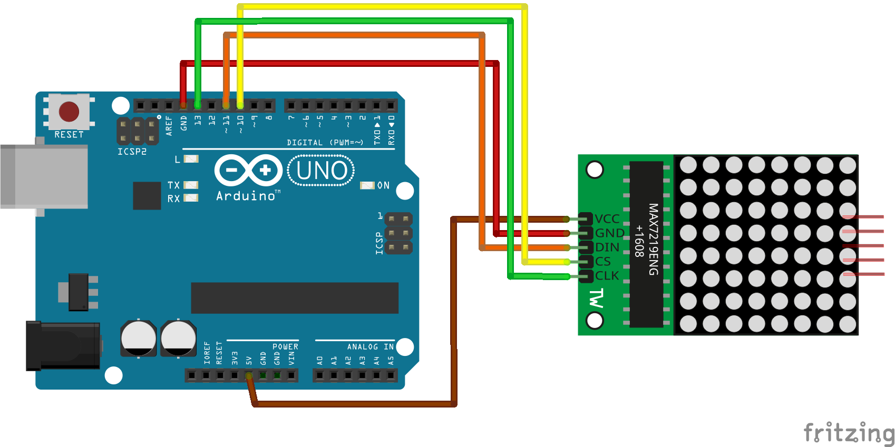

# Arduinoで作る電光掲示板

## 概要
8x8ドットLEDマトリックスとArduinoを使用し、電光掲示板を作成するプログラムです。

紹介動画は[こちら](https://www.youtube.com/watch?v=EXBzsvafvdU)

## 用意する物
Arduino Unoを使用します。[スイッチサイエンス](https://www.switch-science.com/catalog/789/)や[Amazon](https://www.amazon.co.jp/s?k=Arduino+uno+r3)などから購入できます。

### ドットLEDマトリックス
４連のドットLEDマトリックスを使用します。[Amazon](https://www.amazon.co.jp/s?k=MAX7219%E3%83%89%E3%83%83%E3%83%88LED+%E3%83%9E%E3%83%88%E3%83%AA%E3%83%83%E3%82%AF%E3%82%B9)などから購入できます

ArduinoとドットLEDマトリックスをつなぐために、ジャンパー線を用意します。[Amazon](https://www.amazon.co.jp/s?k=%E3%82%B8%E3%83%A3%E3%83%B3%E3%83%91%E3%83%BC%E7%B7%9A)などから購入できます。

# 作成方法
## 回路図

## Arduino Software
Arduinoにプログラムを書き込むためのソフトウエアをダウンロードしインストールします。
1. [ここ](https://www.arduino.cc/en/Main/Software)からARDUINO 1.8.13をダウンロードする
1. MAX7219ライブラリを、[ここ](https://github.com/nickgammon/MAX7219_Dot_Matrix)のCodeからZIPでダウンロードする
1.  bitBangedSPIライブラリを、[ここ](https://github.com/nickgammon/bitBangedSPI)のCodeからZIPでダウンロードする
1. PCにインストールする
1. 起動し、ツール＞ボードからArduino UNOを選択
1. スケッチ＞ライブラリをインクルードから、.ZIP形式のライブラリをインストールを選択し、先ほどダウンロードしたMAX7219_Dot_Matrix-master.zipとbitBangedSPI-master.zipをインストールする。

## 実行
1. USBでPCと接続する
1. ツール＞シリアルポートから　Arduino Unoと表示されるポートを選択する
1. プログラムsketch_sample.inoを読み込む
1. 左上の実行ボタンから実行する

